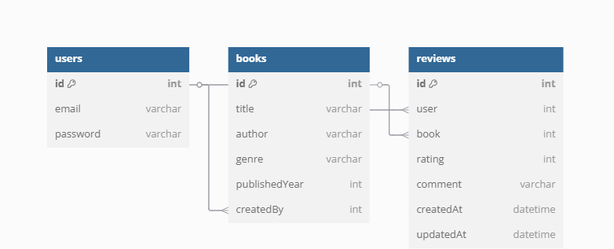

# 📚 Book Review 

A simple RESTful API for managing books and user-submitted reviews, built using Node.js, Express, MongoDB, and JWT for authentication.

---

## 🚀 Features

- User signup & login with hashed passwords
- JWT-based authentication
- Create, read, and search books
- Create, update, and delete reviews (user-specific)
- Book details include average rating & reviews (with pagination)
- Modular structure with clean code and meaningful comments

---

## 🛠️ Tech Stack

- **Backend:** Node.js, Express
- **Database:** MongoDB (Mongoose ODM)
- **Auth:** JWT, bcrypt
- **Validation:** Middleware & checks
- **Tools:** Postman, dotenv, nodemon

---

## ⚙️ Project Setup Instructions

### 1. Clone the Repository
```bash
git clone https://github.com/prateekpmd/Book-Review.git 
```


### 2. Install Dependencies
```bash
npm install
```

### 3. Configure Environment Variables
```bash
PORT=5000
MONGODB_URI=Your MongoDb Uri
JWT_SECRET=your_jwt_secret_key 
```

## 💻 How to Run Locally

### 1. Start MongoDB
Make sure MongoDB is running on your machine:

### 1. Start the Server
Development Mode:
```bash
npm run dev
```
Server runs at: http://localhost:5000


# 📋 Example API Requests (Postman)
## 1. Auth Module
### 1.1 User Signup
Method: POST

URL: http://localhost:5000/api/auth/signup

```bash
{
  "email": "user@example.com",
  "password": "mypassword"
}
```

### 1.2 User Login
Method: POST

URL: http://localhost:5000/api/auth/login

```bash
{
  "email": "user@example.com",
  "password": "mypassword"
}
```
## 2. Book Module
### 1.1 Create a Book
Method: POST

URL: http://localhost:5000/api/books

Headers:

Authorization: Bearer <YOUR_JWT_TOKEN>

Content-Type: application/json

Body: (raw JSON)
```bash
{
  "title": "Driver 2",
  "author": "Asap Rocky",
  "genre": "Animation",
  "publishedYear": 2015
}

```

### 2.1 Get All Books (with optional filters & pagination)
Method: GET

URL: http://localhost:3000/api/books?author=Orwell&genre=Dystopian&page=1&limit=5

### 2.2 Get Book Details by ID (includes average rating & reviews)
Method: GET

URL: http://localhost:3000/api/books/<BOOK_ID>

### 2.3 Search Books by Title or Author
Method: GET

URL: http://localhost:5000/api/search?query=Asap


## 3. 📝 Review Module — Example API Requests (Postman)
### 3.1 Create a Review for a Book
Method: POST

URL: http://localhost:3000/api/books/<BOOK_ID>/reviews

Headers:

Authorization: Bearer <YOUR_JWT_TOKEN>

Content-Type: application/json

Body: (raw JSON)
```bash
{
  "rating": 5,
  "comment": "Amazing book! A must-read."
}

```

### 3.2 Update Your Review
Method: PUT

URL: http://localhost:3000/api/reviews/<REVIEW_ID>

Headers:

Authorization: Bearer <YOUR_JWT_TOKEN>

Content-Type: application/json

Body: (raw JSON)

```bash
{
  "rating": 4,
  "comment": "Updated review: still great but noticed some flaws."
}

```

### 3.3 Delete Your Review
Method: DELETE

URL: http://localhost:3000/api/reviews/<REVIEW_ID>

Headers:

Authorization: Bearer <YOUR_JWT_TOKEN>

## 🎯 Design Decisions & Assumptions Made
Authentication:
JWT-based authentication is used for stateless and scalable user session management. Each protected route requires a valid token in the Authorization header.

Authorization:
Only the user who created a review can update or delete it. Admin roles are not implemented since it's a user-focused review system.

Modular Structure:
Code is organized into controllers, models, and routes to ensure clean separation of concerns and easier maintenance.

Error Handling:
Simple and consistent error responses (with proper HTTP status codes) are returned to the client for debugging.

Validation:
Input validation is handled through middleware to ensure incoming data is safe and complete before hitting database logic.

Environment Config:
Sensitive credentials like database URI and JWT secret are stored in a .env file for security and easy environment switching.

Database Assumption:
MongoDB is assumed to be running locally or in the cloud (e.g., MongoDB Atlas), and accessible via the configured connection string.

Review Constraint:
Each user can submit only one review per book to prevent duplicate reviews and ensure fairness.

## 🗂️ Database Schema
### 👤 User
| Field      | Type   | Description          |
| ---------- | ------ | -------------------- |
| `email`    | String | Unique user email    |
| `password` | String | Hashed user password |


### 📚 Book
| Field           | Type     | Description                       |
| --------------- | -------- | --------------------------------- |
| `title`         | String   | Book title                        |
| `author`        | String   | Book author                       |
| `genre`         | String   | Book genre/category               |
| `publishedYear` | Number   | Year the book was published       |
| `createdBy`     | ObjectId | Refers to the user who created it |


### Review
| Field        | Type     | Description                                        |
| ------------ | -------- | -------------------------------------------------- |
| `user`       | ObjectId | Reference to the reviewer (User)                   |
| `book`       | ObjectId | Reference to the reviewed book                     |
| `rating`     | Number   | Rating from 1 to 5                                 |
| `comment`    | String   | User's review comment                              |
| `timestamps` | Date     | Automatically includes `createdAt` and `updatedAt` |


## 🔗 Relationships
A User can create many Books

A User can post many Reviews

A Book can have multiple Reviews

A Review belongs to one User and one Book




